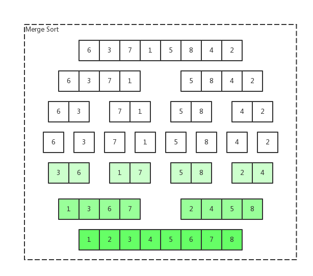
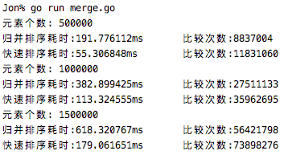

## 归并排序(Merge Sort)

归并排序是一种稳定的排序算法

- 算法时间复杂度: O(n*log*n)

- 核心思想

  将两个已排序的序列合并为一个有序序列

- 主要步骤

  - 分解：将待排序列分解为最小待排序列
  - 解决：将序最小待排序列排序
  - 合并：将两个上述序列合并成新的有序序列

- 流程图

  

- 代码示例

  ```go
  func MergeSort(array []int) []int {
  	length := len(array)
  	if length < 2 { return array }
      
  	key := length / 2
  	left := MergeSort(array[:key])
  	right := MergeSort(array[key:])
  
  	return merge(left, right)
  }
  
  func merge(left []int, right []int) []int {
  	var list []int
  	i, j := 0, 0
  	for i < len(left) && j < len(right) {
  		if left[i] < right[j] {
  			list = append(list, left[i])
  			i++
  		} else {
  			list = append(list, right[j])
  			j++
  		}
  	}
  	list = append(list, left[i:]...)
  	list = append(list, right[j:]...)
  	return list
  }
  ```

## 归并排序与快速排序

|          | 算法时间复杂度 | 平均情况   | 最差情况   | 稳定性 |
| :------- | -------------- | ---------- | ---------- | ------ |
| 归并排序 | O(nlog(n))     | O(nlog(n)) | O(nlog(n)) | 稳定   |
| 快速排序 | O(nlog(n))     | O(nlog(n)) | O(n^2)     | 不稳定 |

- 实际测试结果

  